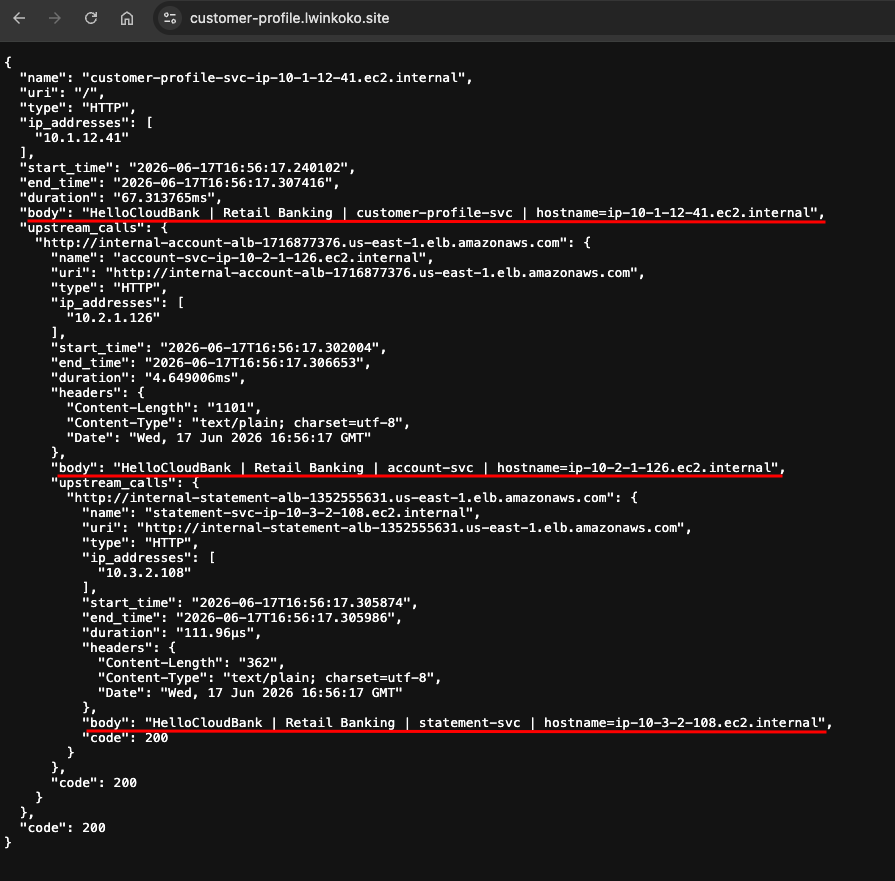

# AWS Multi-VPC Banking Microservices

This project demonstrates a production-style AWS networking architecture for a fake banking microservices application.

The system contains three services:

- Customer Profile Service
- Account Service
- Statement Service

Each service is deployed in a separate VPC. The services communicate privately using internal Application Load Balancers and VPC Peering.

Only the Customer Profile service is exposed to the internet. The Account and Statement services are private backend services.

---

## Architecture Diagram


---

## Project Goal

The goal of this project is to understand how to design private service-to-service communication across multiple AWS VPCs.

This project focuses on:

- Multi-VPC architecture
- Public and private subnet design
- Internet-facing and internal ALB design
- Private EC2 deployment
- VPC Peering
- Route table configuration
- Security group control
- Private S3 access using Gateway Endpoints
- DNS and HTTPS using Route 53 and ACM

---

## AWS Services Used

- Amazon VPC
- Public Subnets
- Private Subnets
- Internet Gateway
- Application Load Balancer
- Internal Application Load Balancer
- Target Groups
- Auto Scaling Group
- Launch Template
- Amazon EC2
- VPC Peering
- Route Tables
- Security Groups
- Route 53
- AWS Certificate Manager
- Amazon S3
- S3 Gateway VPC Endpoint
- IAM Role for EC2
- EC2 Instance Connect Endpoint

---

## Architecture Overview

This project uses three VPCs.

| Service | VPC CIDR | ALB Type | EC2 Location | Service Port |
|---|---|---|---|---|
| Customer Profile | 10.1.0.0/16 | Internet-facing ALB | Private subnets | 9091 |
| Account | 10.2.0.0/16 | Internal ALB | Private subnets | 9092 |
| Statement | 10.3.0.0/16 | Internal ALB | Private subnets | 9093 |

Each VPC is deployed across two Availability Zones for high availability.

---

## Traffic Flow

```text
User
  ↓
Customer Profile Public ALB
  ↓
Customer Profile EC2 Service
  ↓
Account Internal ALB
  ↓
Account EC2 Service
  ↓
Statement Internal ALB
  ↓
Statement EC2 Service
```

Only the Customer Profile ALB is public.

The Account and Statement ALBs are internal and can only be reached privately through VPC Peering.

---

## Security Design

The architecture follows a controlled access model.

| Source | Destination | Port |
|---|---|---|
| Internet | Customer Profile ALB | 80, 443 |
| Customer Profile ALB | Customer Profile EC2 | 9091 |
| Customer Profile Service | Account ALB | 80 |
| Account ALB | Account EC2 | 9092 |
| Account Service | Statement ALB | 80 |
| Statement ALB | Statement EC2 | 9093 |

Backend services are not exposed to the internet.

---

## Private S3 Access

The fake-service binary is stored in an S3 bucket.

EC2 instances download the binary during boot using Launch Template user data.

Because the EC2 instances are deployed in private subnets, they access S3 through S3 Gateway VPC Endpoints.

This allows the private EC2 instances to download the application binary without using a NAT Gateway.

---

## DNS and HTTPS

Route 53 is used for DNS.

AWS Certificate Manager is used to provide HTTPS for the public Customer Profile ALB.

Example public endpoint:

```text
https://customer-profile.example.com
```

---

## Test Result

After deployment, accessing the Customer Profile endpoint returns the full upstream service response chain.



Example response:

```json
{
  "body": "HelloCloudBank | Retail Banking | customer-profile-svc",
  "upstream_calls": {
    "account-service": {
      "body": "HelloCloudBank | Retail Banking | account-svc",
      "upstream_calls": {
        "statement-service": {
          "body": "HelloCloudBank | Retail Banking | statement-svc",
          "code": 200
        }
      },
      "code": 200
    }
  },
  "code": 200
}
```

---

## What I Learned

Through this project, I learned:

- How to design a multi-VPC architecture on AWS
- How VPC Peering enables private communication between VPCs
- How route tables control cross-VPC traffic
- How to expose only one public entry point
- How internal ALBs can be used for backend services
- How security groups control ALB-to-EC2 access
- How private EC2 instances can access S3 using Gateway Endpoints
- How Auto Scaling Groups improve availability and instance recovery
- How Route 53 and ACM are used for DNS and HTTPS
- How to troubleshoot target group health checks and backend timeout issues

---

## Troubleshooting Summary

Some issues I faced during the project:

### 1. Target Group Health Check Failed

The EC2 security group did not allow traffic from the ALB security group on the application port.

Fix:

```text
Allow ALB security group → EC2 security group on service port
```

### 2. Internal ALB Timeout

VPC Peering was active, but route tables were missing routes to the peer VPC CIDR.

Fix:

```text
Add route table entries for each peer VPC CIDR
```

### 3. S3 Download Failed

Private EC2 instances could not download the fake-service binary from S3.

Fix:

```text
Create S3 Gateway Endpoint and attach it to the private route tables
```

### 4. Upstream Service Error

The upstream ALB URL in user data was incorrect.

Fix:

```text
Update the service environment variable with the correct internal ALB DNS name
```

---

## Cleanup

To avoid AWS charges, delete the following resources after testing:

- Auto Scaling Groups
- EC2 instances
- Launch Templates
- Application Load Balancers
- Target Groups
- VPC Peering Connections
- VPC Endpoints
- Route 53 records
- ACM certificates
- S3 objects and bucket
- VPCs, subnets, route tables, and security groups

---

## Author

Created by Lwin Ko Ko

DevOps Engineer | Cloud Engineer

This project is part of my AWS and DevOps hands-on learning journey.