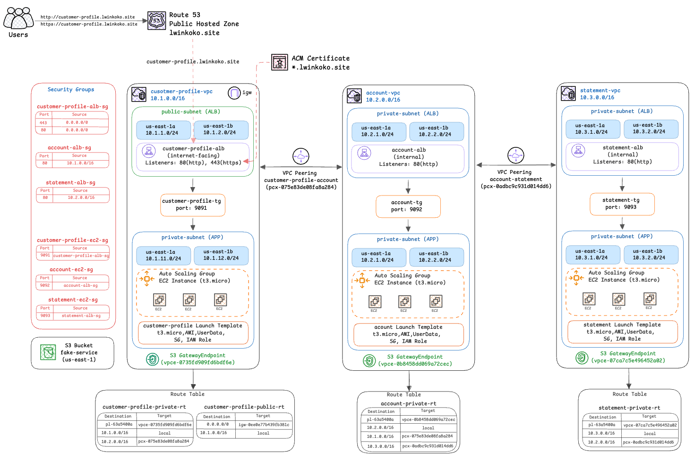
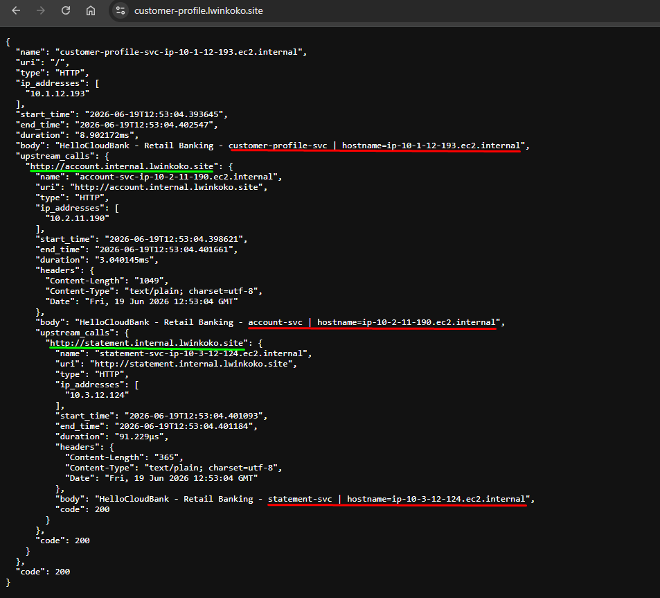

# AWS Multi-VPC Banking Microservices

A hands-on AWS networking and Infrastructure as Code project that deploys a fake banking microservices application across three VPCs.

This project was first deployed manually to understand each AWS component and network flow step by step. After confirming that the architecture worked, I rebuilt the same infrastructure using Terraform.

The lab was deployed in `us-east-1` across two Availability Zones.

---

## Project Overview

The application contains three services:

* Customer Profile Service
* Account Service
* Statement Service

Each service runs in its own VPC and communicates privately with the next service.

Only the Customer Profile service is publicly accessible.

```text
User
  ↓
Customer Profile Public ALB
  ↓
Customer Profile Service
  ↓
Account Internal ALB
  ↓
Account Service
  ↓
Statement Internal ALB
  ↓
Statement Service
```

---

## Architecture Diagram



---

## Deployment Approaches

This project was completed in two ways.

| Approach             | Purpose                                                                                                                        |
| -------------------- | ------------------------------------------------------------------------------------------------------------------------------ |
| Manual Deployment    | Used to understand AWS networking, VPC Peering, routing, security groups, ALBs, and private service communication step by step |
| Terraform Deployment | Used to automate and recreate the same architecture consistently using Infrastructure as Code                                  |

---

## AWS Services Used

* Amazon VPC
* Public and private subnets
* Internet Gateway
* Application Load Balancer
* Internal Application Load Balancer
* Amazon EC2
* Launch Templates
* Auto Scaling Groups
* Target Groups
* VPC Peering
* Route Tables
* Security Groups
* Amazon Route 53
* AWS Certificate Manager
* Amazon S3
* S3 Gateway VPC Endpoint
* IAM Role and Instance Profile
* EC2 Instance Connect Endpoint
* AWS Systems Manager VPC Endpoints

---

## Architecture Overview

| Service          | VPC CIDR      | Load Balancer       | Instance Location | Application Port |
| ---------------- | ------------- | ------------------- | ----------------- | ---------------: |
| Customer Profile | `10.1.0.0/16` | Internet-facing ALB | Private subnets   |           `9091` |
| Account          | `10.2.0.0/16` | Internal ALB        | Private subnets   |           `9092` |
| Statement        | `10.3.0.0/16` | Internal ALB        | Private subnets   |           `9093` |

Each VPC spans two Availability Zones for improved availability.

---

## Security Design

Only the Customer Profile ALB accepts public traffic.

| Source                   | Destination                    |        Port |
| ------------------------ | ------------------------------ | ----------: |
| Internet                 | Customer Profile ALB           | `80`, `443` |
| Customer Profile ALB     | Customer Profile EC2 instances |      `9091` |
| Customer Profile service | Account internal ALB           |        `80` |
| Account ALB              | Account EC2 instances          |      `9092` |
| Account service          | Statement internal ALB         |        `80` |
| Statement ALB            | Statement EC2 instances        |      `9093` |

The Account and Statement services are private and are not directly exposed to the internet.

---

## Private Service Communication

The services communicate through VPC Peering and internal Application Load Balancers.

```text
Customer Profile VPC
        ↓
VPC Peering
        ↓
Account VPC
        ↓
VPC Peering
        ↓
Statement VPC
```

Route tables allow communication between the required VPC CIDR ranges.

Security groups restrict access so that each application service receives traffic only from its related ALB or upstream service path.

---

## Application Runtime

The fake banking services run as `systemd` services on Amazon EC2 instances.

During instance startup, Launch Template user data performs the following steps:

1. Downloads the `fake-service` binary from Amazon S3.
2. Installs it at `/usr/local/bin/fake-service`.
3. Makes the binary executable.
4. Creates or configures the systemd service.
5. Enables and starts the application.
6. Allows the ALB target group health check to verify the service.

| Service          |   Port | Upstream Service       |
| ---------------- | -----: | ---------------------- |
| Customer Profile | `9091` | Account internal ALB   |
| Account          | `9092` | Statement internal ALB |
| Statement        | `9093` | No upstream service    |

The user-data scripts are available in:

```text
user-data/
```

---

## Private S3 Access

The `fake-service` application binary is stored in an Amazon S3 bucket.

Private EC2 instances download the binary through S3 Gateway VPC Endpoints.

This allows the instances to access S3 without requiring a NAT Gateway for application artifact downloads.

The `fake-service` binary is intentionally not included in this GitHub repository.

---

## DNS and HTTPS

Amazon Route 53 is used for DNS configuration.

AWS Certificate Manager is used to provide an HTTPS certificate for the public Customer Profile Application Load Balancer.

Example public endpoint:

```text
https://customer-profile.example.com
```

The Account and Statement services use internal DNS names and are reachable only through private networking.

---

## Terraform Implementation

The same architecture is automated using Terraform.

Terraform code is organized into reusable modules for networking, load balancing, Auto Scaling, IAM, Route 53, ACM, S3, VPC endpoints, and VPC Peering.

```text
terraform/
├── artifacts/
│   └── README.md
├── environments/
│   └── lab/
│       ├── main.tf
│       ├── provider.tf
│       ├── variables.tf
│       ├── outputs.tf
│       ├── versions.tf
│       ├── terraform.tfvars.example
│       └── templates/
└── modules/
    ├── acm/
    ├── alb/
    ├── autoscaling/
    ├── iam/
    ├── route53/
    ├── s3-bucket/
    ├── s3-endpoint/
    ├── security-group/
    ├── ssm-endpoints/
    ├── vpc/
    └── vpc-peering/
```

For full Terraform deployment instructions, see:

[Terraform Deployment Guide](./terraform/README.md)

For information about the local `fake-service` artifact, see:

[Application Artifact Guide](./terraform/artifacts/README.md)

---

## Test Results

### Manual Deployment Result

The manually deployed environment successfully returned the complete upstream response chain.

```text
Customer Profile → Account → Statement → HTTP 200
```


### Terraform Deployment Result

After rebuilding the same architecture with Terraform, the public Customer Profile endpoint successfully reached all backend services.

```text
Customer Profile → Account → Statement → HTTP 200
```



This confirms that the same multi-VPC service chain was successfully recreated using Terraform.

---

## Key Learning Points

* Designing multi-VPC architectures on AWS
* Private service-to-service communication using VPC Peering
* Route table configuration for cross-VPC traffic
* Public versus internal Application Load Balancer design
* Security group rules between ALBs and EC2 instances
* Launch Templates and Auto Scaling Groups
* Private S3 access using Gateway VPC Endpoints
* Running applications through systemd on EC2
* DNS and HTTPS using Route 53 and ACM
* Rebuilding infrastructure consistently using Terraform modules

---

## Troubleshooting Notes

### Target Group Health Check Failed

**Cause:** The EC2 security group did not allow traffic from the ALB security group on the application port.

**Fix:** Allow traffic from the relevant ALB security group to the EC2 security group on the service port.

```text
Customer Profile ALB → Customer Profile EC2 : 9091
Account ALB          → Account EC2          : 9092
Statement ALB        → Statement EC2        : 9093
```

### Internal ALB Timeout

**Cause:** VPC Peering was active, but route tables did not include routes to the peer VPC CIDR range.

**Fix:** Add route table entries for the required VPC CIDR ranges through the relevant VPC Peering connection.

### S3 Download Failed from Private EC2

**Cause:** Private EC2 instances did not have a path to Amazon S3.

**Fix:** Create an S3 Gateway VPC Endpoint and associate it with the private route tables.

### Upstream Service Error

**Cause:** The upstream ALB URL or internal DNS name was incorrect in the application configuration.

**Fix:** Update the systemd environment variables or user-data configuration with the correct internal ALB DNS name.

---

## Important Security Notes

The following files are intentionally not committed to this repository:

```text
terraform.tfstate
terraform.tfstate.backup
terraform.tfvars
.terraform/
fake-service
*.pem
*.key
.env
```

Before using this project, create your own local Terraform variable file:

```bash
cd terraform/environments/lab
cp terraform.tfvars.example terraform.tfvars
```

Update `terraform.tfvars` with your own AWS account values, domain configuration, bucket name, and environment settings.

---

## Cleanup

To remove the Terraform lab resources and avoid unnecessary AWS charges:

```bash
cd terraform/environments/lab
terraform destroy
```

Review the destroy plan carefully before confirming.

For manual deployment, remove the related AWS resources in the following order:

* Auto Scaling Groups and EC2 instances
* Launch Templates
* Application Load Balancers and Target Groups
* VPC Peering Connections
* VPC Endpoints
* Route 53 records
* ACM certificates
* S3 objects and bucket
* VPCs, subnets, route tables, and security groups

---

## Author

Created by **Lwin Ko Ko**

DevOps Engineer | Cloud Engineer

This project is part of my AWS and DevOps hands-on learning journey.
